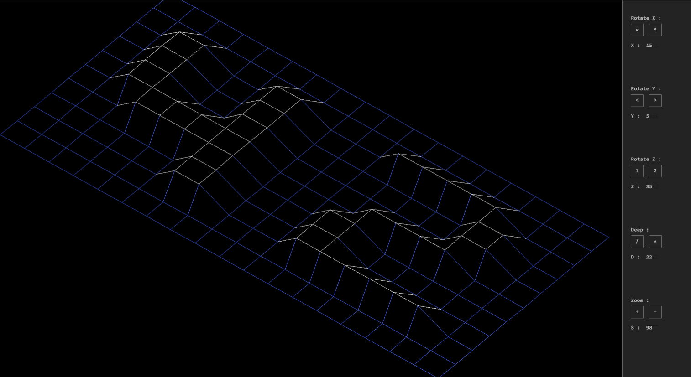
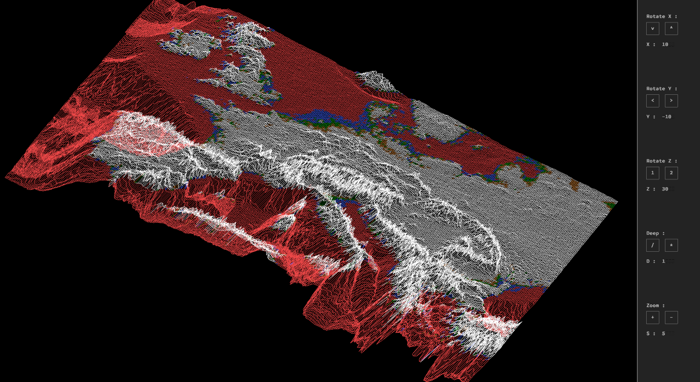
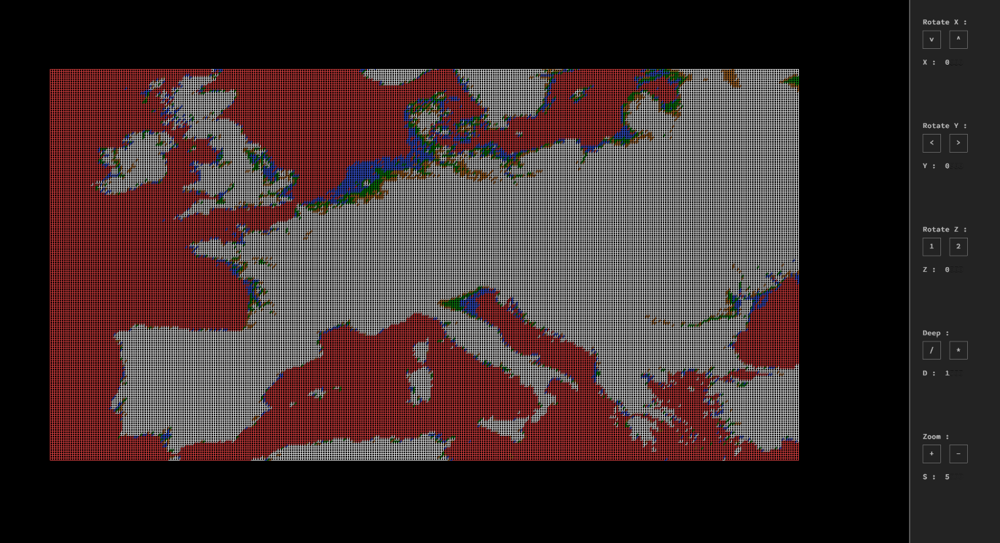

# Fdf

### Project description:
Fdf is the first graphical project we can do at 42
The goal is to represent in '2D' the topographic grid pattern that is given to
us as a parameter, using a graphic library: minilibx.

### Usage
```make``` then ```./fdf file```

touch escape to get out of the program. The keys 'WASD' will help you
move the shape on the screen.
(edit.): due to changes in maj Mojave OpenGL, you will have warning while compiling
the project, it is normal, but the programm will work

### Example:
Here is an example of a valid file:
$> cat test_maps/42.fdf

```
0  0  0  0  0  0  0  0  0  0  0  0  0  0  0  0  0  0  0
0  0  0  0  0  0  0  0  0  0  0  0  0  0  0  0  0  0  0
0  0 10 10  0  0 10 10  0  0  0 10 10 10 10 10  0  0  0
0  0 10 10  0  0 10 10  0  0  0  0  0  0  0 10 10  0  0
0  0 10 10  0  0 10 10  0  0  0  0  0  0  0 10 10  0  0
0  0 10 10 10 10 10 10  0  0  0  0 10 10 10 10  0  0  0
0  0  0 10 10 10 10 10  0  0  0 10 10  0  0  0  0  0  0
0  0  0  0  0  0 10 10  0  0  0 10 10  0  0  0  0  0  0
0  0  0  0  0  0 10 10  0  0  0 10 10 10 10 10 10  0  0
0  0  0  0  0  0  0  0  0  0  0  0  0  0  0  0  0  0  0
0  0  0  0  0  0  0  0  0  0  0  0  0  0  0  0  0  0  0

```
output:


other example with a map of Europe:




